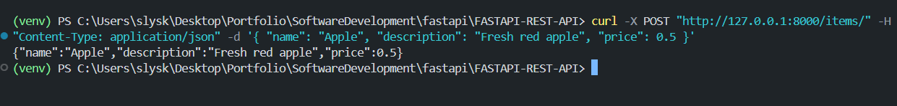
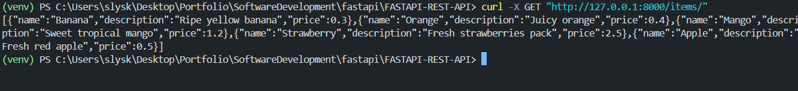
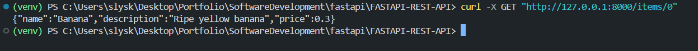
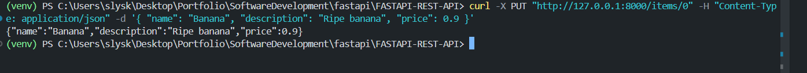
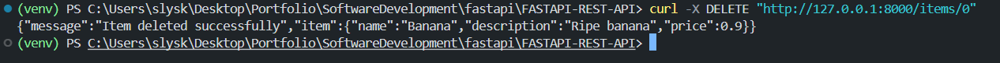

---

# 🚀 FastAPI REST API

A simple **REST API** built with [FastAPI](https://fastapi.tiangolo.com/) that supports full **CRUD operations** for managing a list of items.  
The Items get stored into a JSON.

---


```
📌 Example:
[Insert Swagger UI Screenshot]
[Insert ReDoc Screenshot]
[Insert Terminal Output Screenshot]
```

---

## 📂 Project Structure

```
FASTAPI-REST-API/
│
├── main.py           # FastAPI application
├── requirements.txt  # Dependencies
├── LICENSE           # Apache 2.0 license
└── README.md         # Documentation
└── screenshots       # Screenshots of README images
```

---

## 🔧 Installation & Setup

### 1. Clone the repository

```bash
git clone https://github.com/slyskenk/FASTAPI-REST-API.git
cd FASTAPI-REST-API
```

### 2. Create and activate a virtual environment (recommended)

```bash
python -m venv venv

# macOS/Linux
source venv/bin/activate

# Windows
venv\Scripts\activate
```

### 3. Install dependencies

```bash
pip install -r requirements.txt
```

### 4. Run the FastAPI app

```bash
uvicorn main:app --reload
```

### 5. Open your browser

- Swagger UI: [http://127.0.0.1:8000/docs](http://127.0.0.1:8000/docs)  
- ReDoc: [http://127.0.0.1:8000/redoc](http://127.0.0.1:8000/redoc)

---

## 🔥 API Endpoints

| Method | Endpoint            | Description             | Request Body                  |
|--------|---------------------|-------------------------|-------------------------------|
| GET    | `/`                 | Welcome message         | None                          |
| POST   | `/items/`           | Create a new item       | `{name, description, price}`  |
| GET    | `/items/`           | List all items          | None                          |
| GET    | `/items/{item_id}`  | Get a specific item     | None                          |
| PUT    | `/items/{item_id}`  | Update a specific item  | `{name, description, price}`  |
| DELETE | `/items/{item_id}`  | Delete a specific item  | None                          |

---

## 🛠 Example Usage with `curl`

### ➕ Create an Item
| |
```bash
curl -X POST "http://127.0.0.1:8000/items/" -H "Content-Type: application/json" -d '{ "name": "Apple", "description": "Fresh red apple", "price": 0.5 }'
```

### 📋 Get All Items
| |
```bash
curl -X GET "http://127.0.0.1:8000/items/"
```

### 🔍 Get an Item by ID
| |
```bash
curl -X GET "http://127.0.0.1:8000/items/0"
```

### ✏️ Update an Item
| |
```bash
curl -X PUT "http://127.0.0.1:8000/items/0" -H "Content-Type: application/json" -d '{ "name": "Banana", "description": "Ripe banana", "price": 0.9 }'
```

### ❌ Delete an Item
| |
```bash
curl -X DELETE "http://127.0.0.1:8000/items/0"
```

---

## 🌟 Why FastAPI?

- 🚀 **Fast**: High performance, built on Starlette and Pydantic.
- 📝 **Automatic Docs**: Swagger UI and ReDoc out-of-the-box.
- 🔒 **Validation**: Automatic request validation with Pydantic.
- 🧩 **Modern**: Async-ready, type hints, and scalable architecture.

---

## 🖋 Author

**Slysken Kakuva** – [GitHub Profile](https://github.com/slyskenk)

---

## 📜 License

This project is licensed under the **Apache License 2.0**.  
See the [LICENSE](http://www.apache.org/licenses/LICENSE-2.0) file for details.

---


